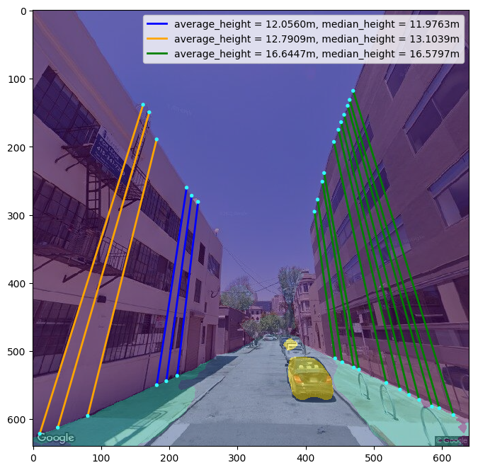
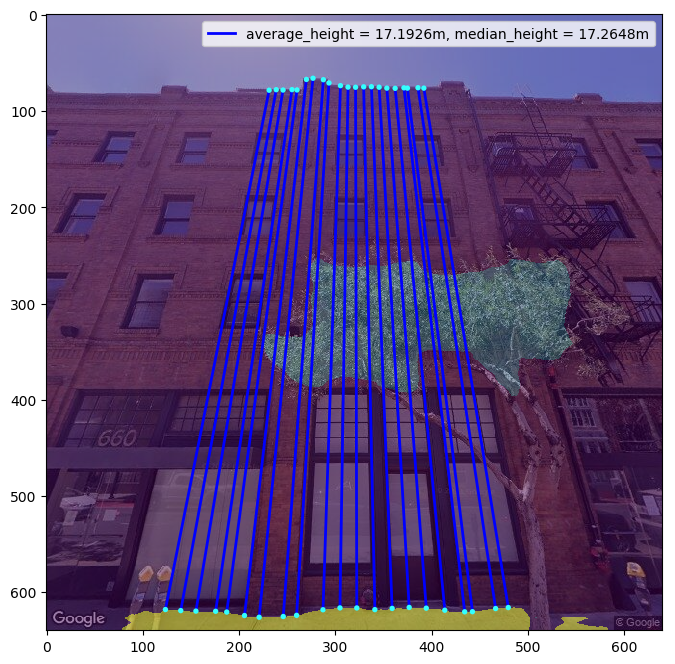

# SIHE: estimation of building height from a single street view image 
This repository contains the Python implementation of the building height estimation method 
in the paper: *Yan Y, Huang B. ["Estimation of building height using a single street view image via deep neural networks"](https://www.sciencedirect.com/science/article/abs/pii/S0924271622002106)*. ISPRS Journal of Photogrammetry and Remote Sensing, 2022, 192: 83-98.

# Introduction
SIHE (Single Image Height Estimation) is a tool designed to estimate building heights from a single street view image, 
utilizing single-view metrology principles. By harnessing geometric information and features like vanishing points, 
line segments, and semantic masks, which can be automatically extracted through deep neural networks, SIHE can 
determines building vertical lines and building heights.

# Setup
Simply clone this repo or download the zip file onto your local machine, then install `requirements.txt` file to install relevant python packages:

```
$ git clone https://github.com/
$ python install -r requirements.txt
```

# Code Structure
Below is a quick overview of the function of each file.

```bash
########################### height estimation code ###########################    
config/                         # configurations
    estimation_config.ini       # default parameters for height estimation
data/                           # default folder for placing the data
    imgs/                       # folder for original street view images
    lines/                      # folder for detected line segment files
    segs/                       # folder for semantic segmented image files
    vpts/                       # folder for detected vanishing point files
misc/                           # misc files
simulationSystem/               # scripts for simulation and theoretical analysis

demo.py                         # main function
filesIO.py                      # functions for loading files
heightMeasurement.py            # functions for height measurement
lineClassification.py           # functions for line segment classification
lineDrawingConfig.py            # script for line visualization configuration
lineRefinement.py               # functions for line segment refinement
```

# Get started
Use `demo.py` to run the code with sample data and default parameters. Execute the following command in the terminal, 
or add `img_path config_fname` in the Parameters when run `demo.py` in PyCharm:
```bash
python ./demo.py ./data/imgs/ ./config/estimation_config.ini
```

The height estimation results will be written to `./data/ht_results/` accordingly.

The main estimation function is the `heightCalc()` function and 
there are two important parameters:

* `use_pitch_only`: when the value is '1', use only the pitch angle to calculate 
  vanishing line and vertical vanishing point for height measurement
* `use_detected_vpt_only`: when the value is '1', use only the detected vanishing
  points for height measurement
  
The vanishing points can be detected from the image using neural networks, 
or calculated using pitch angle (when the rotation angles of the image are known 
from the data source, e.g. Google Street View). The setting of the two parameters
depends on how vanishing points are obtained.

# How to use
In the estimation of building height, semantic segmentation map of the street view 
image, line segments, and vanishing points are used. Since they can be obtained 
through different neural networks, the codes of the networks are not integrated 
in the main stream of height estimation. Instead, the street view images are 
separately processed by three networks, and the result files are prepared for later
height measurement (as in `./data/lines`, `./data/segs`, `./data/vpts`).

* line segment detection: use LCNN network [1]
* semantic segmentation: use MMSegmentation toolbox [2]
* vanishing point detection: use NeurVPS network [3] with newly-trained model
  (in `./misc/vps_models/`)
  
The installation and usage of the networks can be referred to their official 
repository. More details about the setup for this study can be referred to our paper.
In addition, other networks can be tried for better results. If so, the config file `estimation_config.ini` 
may need to be modified to align with the data, such as the segmentation labels. 

When the above mentioned result files are prepared, the `demo.py` can be used to estimate heights. 


# Example results

| Fig. 1 | Fig. 2 |
| ---------------------------------- | ----------------------------------  |
|               |                                      |


# Acknowledgements
We appreciate the open source of the following projects: 

[1] [lcnn](https://github.com/zhou13/lcnn) \
[2] [mmsegmentation](https://github.com/open-mmlab/mmsegmentation) \
[3] [neurvps](https://github.com/zhou13/neurvps)


